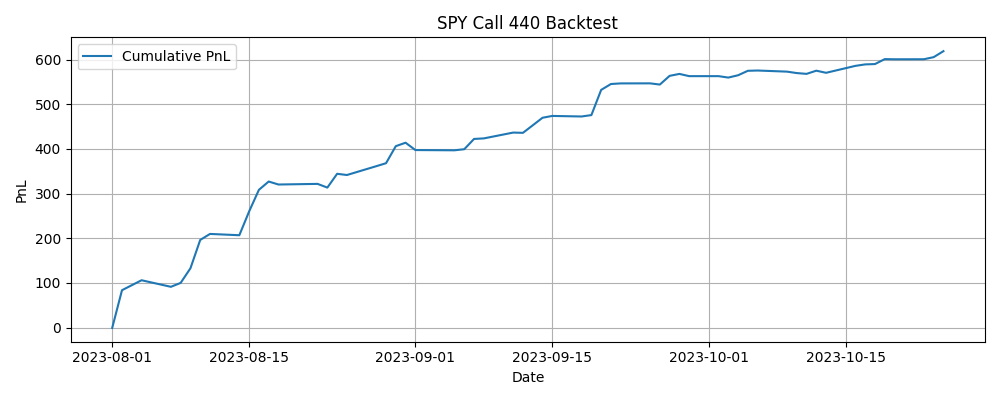

# Option-Trading-Strategy

A backtest of a market taking Black-Scholes model option trading strategy. See `main.py` for example usage.  

---

### Backtest Parameters:

- **symbol**: underlying asset (e.g. SPY)  
- **strike**: strike price, at default is set to roughly ATM  
- **option_type**: call or put  
- **window_start**: backtesting window start date  
- **window_end**: backtesting window end date  
- **expiry_delta_days**: expiry data on the options (set to trading 2 weeks until expiry by default)  
- **r**: interest rate, adjusted to FED rate by default  
- **edge_entry**: how large of a theoretical expected pnl we require to enter a long/short position  
- **edge_exit**: determines the threshold for closing a position  
- **max_pos**: largest long/short position allowed (magnitude)  
- **vol_half_life_min**: EWMA volatility estimate parameter  
- **fetch_data**: do we want to pull data from polygon? (must set to True if running for the first time)  

---

### Outputs:

- `underlying.csv` (fetch data): underlying asset prices over the backtest window  
- `option_bars.csv` (fetch data): real option price data from polygon API over the backtesting window  
- `bid_asks.csv`: simulates the market bid ask spreads and tracks quantity estimates (volatility, theoretical price)  
- `trades.csv`: a record of all trades executed in the backtest  
- `daily_pnl.csv`: records the pnl at the end of each day  
- `pnl_plot.png`: a plot of the cumulative pnl from the start of the backtest for each day  

---

### Trading Strategy:

- Estimate the market volatility using the underlying asset price data.  
- Compute the theoretical price of the option using the Black-Scholes model  
- Calculate the difference between the trade price (from bid ask spreads) and our theoretical price — call this the edge  
- If the 'edge' is sufficiently large, open a (long/short) position if edge is (positive/negative)  
- Once we have an open position, look to either close it down, add to it, or do nothing depending on the current edge up to a maximum position size (10 by default)  
- Calculate the pnl from each closed position  
- At the end of the trading day, close any open positions to stay neutral going into the next day  

---

### PnL Plot with Default Parameters:

---

Built by Jaden Gray — feel free to reach out for collaborations or feedback.